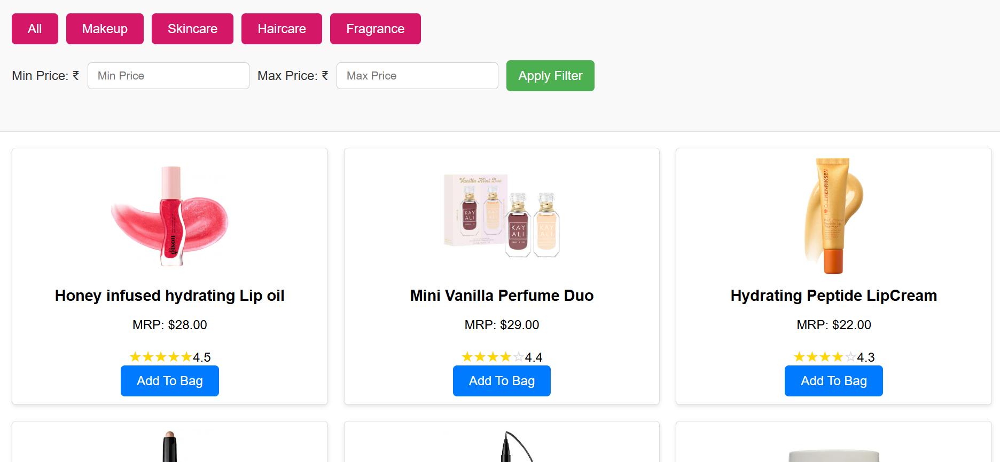
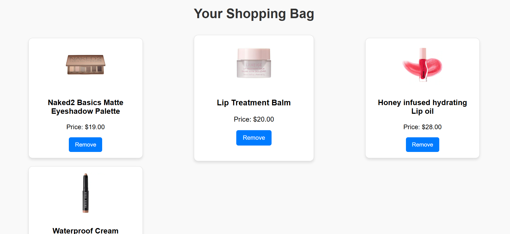
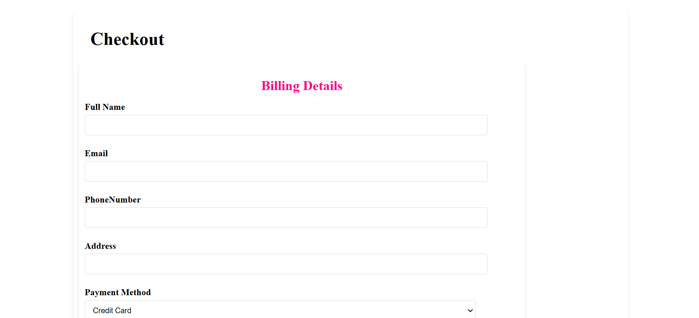
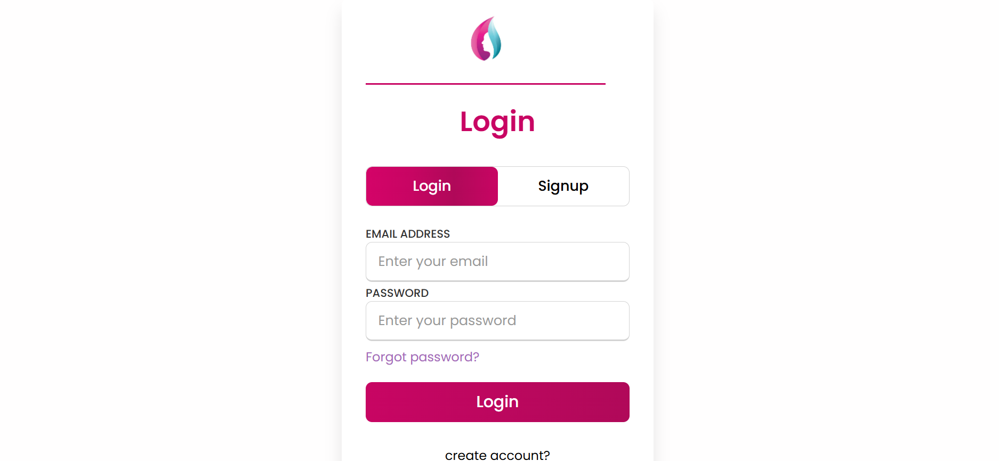

# GlowUp Hub : A Beauty e-commerce Website

Welcome to **GlowUp Hub**, a beautiful and user-friendly e-commerce website where you can explore and purchase top-quality beauty products. From skincare to makeup, we offer a wide range of products to enhance your beauty.

## Features

1. **Main Page**: 
   - Includes a search bar to search for products.
   - Displays featured categories and products.
   - Includes a cart icon where you can view the number of items in your cart.

2. **Navigation Bar**:
   - Links to **Categories** and **Sign In** pages.
   - The cart icon shows the current number of items in the cart.

3. **Categories Page**:
   - Displays various categories such as Skincare, Makeup, Haircare, etc.
   - Allows filtering based on product categories and price.

4. **Login Page**:
   - Users can sign in or create an account to access their personal information and order history.

5. **Checkout Page**:
   - Allows users to enter their shipping details and place an order.
   - Displays an order confirmation message upon successful order placement.

6. **Footer**:
   - Includes details about the products, shipping info, and the GlowHub brand.

---

## Installation

### Prerequisites

1. **Node.js**: Make sure Node.js is installed on your machine. You can download it from [here](https://nodejs.org/).

2. **Clone the Repository**:
   Clone the repository to your local machine using Git.

   ```bash
   git clone https://github.com/yourusername/GlowHub.git


## Screenshots

### Main Page


### Categories Page


### Cart Page


### Checkout Page


### Login Page


### GitHub Repo Link
Here is my Github Repo Link - [Repo Link]https://github.com/NIHARIKA-SUREDDI/GlowUpHub.git